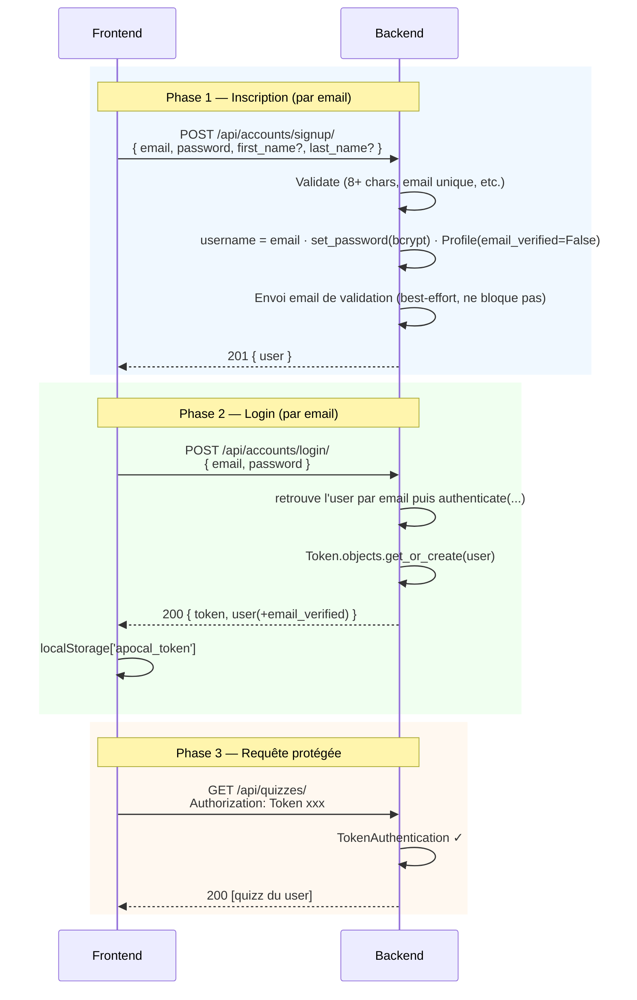

# 03 — Authentification

Comment fonctionne l'auth REST du kit, et où ajouter de la logique métier.

---

## 🎯 Choix architectural

| Choix | Pourquoi |
|---|---|
| **Identifiant = email** | À l'inscription, `username = email` en interne. Pas de champ « pseudo » à gérer ; login par email. |
| **Token DRF** | Stateless côté serveur, parfait pour un front React |
| **+ Session Django activée** | Permet l'utilisation de Swagger UI (auth via login) |
| **Validation d'email « soft »** | Le compte marche tout de suite ; un bandeau invite à confirmer (champ `Profile.email_verified`). |
| **Tokens sans stockage en base** | `django.core.signing` (validation email) + `default_token_generator` (reset). |
| Pas de **JWT** dans le kit | Surdimensionné, pas de besoin de federation/expiry court |
| **bcrypt** (Django par défaut) | Standard sécurité, validation `password_validators` activée |
| Pas de **CORS** ouvert | Whitelist explicite (port du front Vite) |

---

## 🔄 Flux signup → login → action protégée



---

## 🛠️ Endpoints disponibles

| Méthode | URL | Permission | Description |
|---|---|---|---|
| POST | `/api/accounts/signup/` | AllowAny | Crée un compte (par email) + envoie l'email de validation |
| POST | `/api/accounts/login/` | AllowAny | Login par email → `{ token, user }` |
| POST | `/api/accounts/logout/` | IsAuthenticated | Invalide le token + détruit session |
| GET | `/api/accounts/me/` | IsAuthenticated | Utilisateur courant (+ `email_verified`) |
| POST | `/api/accounts/verify-email/` | AllowAny | Confirme l'email à partir du token reçu par mail |
| POST | `/api/accounts/resend-verification/` | IsAuthenticated | Renvoie l'email de validation |
| POST | `/api/accounts/password-reset/` | AllowAny | Demande un lien de reset (anti-énumération) |
| POST | `/api/accounts/password-reset/confirm/` | AllowAny | Définit le nouveau mot de passe (uid + token) |
| GET/PATCH/DELETE | `/api/accounts/profile/` | IsAuthenticated | Consulter / modifier / **supprimer** son compte |
| POST | `/api/accounts/change-password/` | IsAuthenticated | Changer son mot de passe (ancien requis) |

> 💡 La validation d'email et le mot de passe oublié sont **déjà implémentés**
> (voir `accounts/tokens.py`, `accounts/emails.py`, `accounts/views.py`). Servez-vous-en
> comme modèles pour vos propres fonctionnalités.

---

## 🏗️ Étendre — exemple : un endpoint « renvoyer un récapitulatif par email »

Le pattern réutilisable : une vue protégée qui s'appuie sur les helpers d'email
déjà présents (`accounts/emails.py`).

### 1. Helper dans `accounts/emails.py`

```python
def send_recap_email(user, nb_quizzes: int) -> None:
    body = f"Bonjour, vous avez passé {nb_quizzes} quiz. Continuez !"
    send_email(user.email, "Votre récapitulatif — EduTutor IA", body)
```

### 2. Vue dans `accounts/views.py`

```python
class RecapView(APIView):
    permission_classes = [IsAuthenticated]

    def post(self, request):
        nb = request.user.quizzes.count()
        try:
            send_recap_email(request.user, nb)
        except EmailError as exc:           # message déjà explicite (clé Brevo expirée…)
            return Response({"detail": str(exc)}, status=502)
        return Response({"detail": "Récapitulatif envoyé."})
```

### 3. URL dans `accounts/urls.py`

```python
path("recap/", RecapView.as_view(), name="recap"),
```

> ⚠️ Pour tout endpoint qui révèle l'existence d'un compte (ex. reset), gardez le
> principe **anti-énumération** : même réponse, que le compte existe ou non.

---

## 🚨 Sécurité — checklist

### ✅ Bonnes pratiques déjà appliquées

- bcrypt pour les passwords
- Validators Django activés (min 8 chars, common password)
- Token DRF (rotaté à chaque login)
- `IsAuthenticated` par défaut sur les vues métier
- Filtrage par user dans les querysets (`Quiz.objects.filter(user=request.user)`)
- CORS whitelist explicite
- Pas de SECRET_KEY hardcoded (lue depuis `.env` via `python-decouple`)

### ⚠️ À renforcer en production

- [ ] Forcer HTTPS (cf docs/05-ci-cd.md pour le déploiement)
- [ ] Activer rate limiting sur `/login/` (anti-bruteforce)
- [ ] Ajouter `django-axes` ou équivalent (lockout après N tentatives)
- [ ] Configurer `SESSION_COOKIE_SECURE = True` et `CSRF_COOKIE_SECURE = True`
- [ ] Tokens DRF avec expiration (par défaut ils sont infinis !) — voir `djangorestframework-simplejwt` si besoin

### ❌ Anti-pattern à éviter

```python
# ❌ NE FAITES PAS ÇA
return Response({"detail": f"Aucun utilisateur avec {email}"}, status=404)
# → leak de l'existence des comptes

# ✅ FAITES ÇA
return Response(status=204)  # même réponse, qu'il existe ou pas
```

---

## 👉 Suite

- [04-testing.md](./04-testing.md) — Tester les endpoints d'auth
- [07-bonnes-pratiques.md](./07-bonnes-pratiques.md) — DoR / DoD pour sécurité
